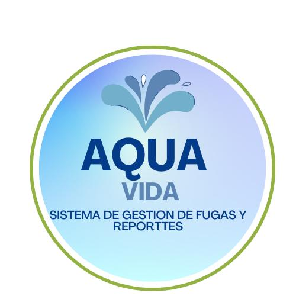

# practica_03
repositorio acerca de de los separadores
####### encabezado de nivel 6 - similar a h6 ebn html
####### encabezado de nivel 7 - solo 6 son los niveles permitidos,a apaaritr  de este el maquetado sera ign orado
### 2.Separadores (SEPARATORS)
 si desea marcar una sepacacion mas visual de contenidos podemos utilizarlos  indicando tres caracteres "_" continuos, en el maquetado
   ### EJEMPLO:
 *esto es similar a un tag de < HR > en html.
 ### 3.Parrafos(PARAGRPAHS)
 Son utilizados  para poder presentar grandese secciones de texto que describen detalladamente las  secciones de la documentacion del proyecto
  ## EJEMPLO :
  Existen tres tipos básicos de GitHub Pages sitios: de proyecto, de usuario y de la organización. Los sitios de proyecto están conectados coon un proyecto específico alojado en GitHub, como una biblioteca JavaScript o una colección de recetas Existen tres tipos básicos de GitHub Pages sitios: de proyecto, de usuario y de la organización. Los sitios de proyecto están conectados coon un proyecto específico alojado en GitHub, como una biblioteca JavaScript o una colección de recetas
  #### Tambien podemos  aplicar diveros estilos basicos de alineacion;
  ## EJEMPLO
  Existen tres tipos básicos de GitHub Pages sitios: de proyecto, de usuario y de la organización. Los sitios de proyecto están conectados coon un proyecto específico alojado en GitHub, como una biblioteca JavaScript o una colección de recetasExisten tres tipos básicos de GitHub Pages sitios: de proyecto, de usuario y de la organización. Los sitios de proyecto están conectados coon un proyecto específico alojado en GitHub, como una biblioteca JavaScript o una colección de recetasExisten tres tipos básicos de GitHub Pages sitios: de proyecto, de usuario y de la organización. Los sitios de proyecto están conectados coon un proyecto específico alojado en GitHub, como una biblioteca JavaScript o una colección de recetas

 
 
  ## EJEMPLO
  Existen tres tipos básicos de GitHub Pages sitios: de proyecto, de usuario y de la organización. Los sitios de proyecto están conectados coon un proyecto específico alojado en GitHub, como una biblioteca JavaScript o una colección de recetasExisten tres tipos básicos de GitHub Pages sitios: de proyecto, de usuario y de la organización. Los sitios de proyecto están conectados coon un proyecto específico alojado en GitHub, como una biblioteca JavaScript o una colección de recetasExisten tres tipos básicos de GitHub Pages sitios: de proyecto, de usuario y de la organización. Los sitios de proyecto están conectados coon un proyecto específico alojado en GitHub, como una biblioteca JavaScript o una colección de recetasExisten tres tipos básicos de GitHub Pages sitios: de proyecto, de usuario y de la organización. Los sitios de proyecto están conectados coon un proyecto específico alojado en GitHub, como una biblioteca JavaScript o una colección de recetaseste texto estara justifciado utilizabdo la propiedaD DE alineacion 

  
   
 
    ### EJEMPLO
    Existen tres tipos básicos de GitHub Pages sitios: de proyecto, de usuario y de la organización. Los sitios de proyecto están conectados coon un proyecto específico alojado en GitHub, como una biblioteca JavaScript o una colección de recetasExisten tres tipos básicos de GitHub Pages sitios: de proyecto, de usuario y de la organización. Los sitios de proyecto están conectados coon un proyecto específico alojado en GitHub, como una biblioteca JavaScript o una colección de recetasExisten tres tipos básicos de GitHub Pages sitios: de proyecto, de usuario y de la organización. Los sitios de proyecto están conectados coon un proyecto específico alojado en GitHub, como una biblioteca JavaScript o una colección de recetasExisten tres tipos básicos de GitHub Pages sitios: de proyecto, de usuario y de la organización. Los sitios de proyecto están conectados coon un proyecto específico alojado en GitHub, como una biblioteca JavaScript o una colección de recetasExisten tres tipos básicos de GitHub Pages sitios: de proyecto, de usuario y de la organización. Los sitios de proyecto están conectados coon un proyecto específico alojado en GitHub, como una biblioteca JavaScript o una colección de receta

   

 ## EJEMPLO
 Existen tres tipos básicos de GitHub Pages sitios: de proyecto, de usuario y de la organización. Los sitios de proyecto están conectados coon un proyecto específico alojado en GitHub, como una biblioteca JavaScript o una colección de recetasExisten tres tipos básicos de GitHub Pages sitios: de proyecto, de usuario y de la organización. Los sitios de proyecto están conectados coon un proyecto específico alojado en GitHub, como una biblioteca JavaScript o una colección de recetasExisten tres tipos básicos de GitHub Pages sitios: de proyecto, de usuario y de la organización. Los sitios de proyecto están conectados coon un proyecto específico alojado en GitHub, como una biblioteca JavaScript o una colección de recetasExisten tres tipos básicos de GitHub Pages sitios: de proyecto, de usuario y de la organización. Los sitios de proyecto están conectados coon un proyecto específico alojado en GitHub, como una biblioteca JavaScript o una colección de recetasExisten tres tipos básicos de GitHub Pages sitios: de proyecto, de usuario y de la organización. Los sitios de proyecto están conectados coon un proyecto específico alojado en GitHub, como una biblioteca JavaScript o una colección de receta

## DIVERSOS ESTILOS DE RESALTADO DE TEXTO(bold, italic, bold/italic)
para agegar diversos estilos y resaltar tu texto
##### TEXTO EN NEGRITA(bold)
 para poder poner el texto en negrita ,este debera ser encerrado entre dobles **

 ### EJEMPLO
 texto  **Existen tres tipos básicos de GitHub Pages sitios: de proyecto, de usuario y de la organización. Los sitios de proyecto están conectados coon un proyecto específico alojado en GitHub, como una biblioteca JavaScript o una colección de recetasExisten tres tipos básicos de GitHub Pages sitios: de proyecto, de usuario y de la organización. Los sitios de proyecto están conectados coon un proyecto específico alojado en GitHub, como una biblioteca JavaScript o una colección de recetasExisten tres tipos básicos de GitHub Pages sitios:** de proyecto, de usuario y de la organización. Los sitios de proyecto están conectados coon un proyecto específico alojado en GitHub, como una biblioteca JavaScript o una colección de recetasExisten tres tipos básicos de GitHub Pages sitios: de proyecto, de usuario y de la organización. Los sitios de proyecto están conectados coon un proyecto específico alojado en GitHub, como una biblioteca JavaScript o una colección de recetasExisten tres tipos básicos de GitHub Pages sitios: de proyecto, de usuario y de la organización. Los sitios de proyecto están conectados coon un proyecto específico alojado en GitHub, como una biblioteca JavaScript o una colección de receta
 ##### TEXTO EN CURSIVA(italic)
 para resaltar algunas secciones a textos en cursiva se necesita enmarcar el texto entre *.(asterisco)
### EJEMPLO
 
   *Existen tres tipos básicos de GitHub Pages sitios: de proyecto, de usuario y de la organización. Los sitios de proyecto están conectados coon un proyecto específico alojado en GitHub, como una biblioteca JavaScript o una colección de recetasExisten tres tipos básicos de GitHub Pages sitios: de proyecto, de usuario y de la organización. Los sitios de proyecto están conectados coon un proyecto específico alojado en GitHub, como una biblioteca JavaScript o una colección de recetas*Existen tres tipos básicos de GitHub Pages sitios: de proyecto, de usuario y de la organización. Los sitios de proyecto están conectados coon un proyecto específico alojado en GitHub, como una biblioteca JavaScript o una colección de recetasExisten tres tipos básicos de GitHub Pages sitios: de proyecto, de usuario y de la organización. Los sitios de proyecto están conectados coon un proyecto específico alojado en GitHub, como una biblioteca JavaScript o una colección de recetasExisten tres tipos básicos de GitHub Pages sitios: de proyecto, de usuario y de la organización. Los sitios de proyecto están conectados coon un proyecto específico alojado en GitHub, como una biblioteca JavaScript o una colección de receta
   #### TEXTO BOLD ITALIC
   DE igual manera podemos unir ambos estilos **negrita** y *cursiva* para resaltar  los textos 
   se debe usar triple* (asterisco)
    texto texto texto texto ***texto en negrita  y cursiva*** texto texto
     
 #### SUBRAYADO (UNDERLINE)
 Nos servimos del subrayado para destacar las ideas más importantes del texto o del tema a estudiar: Seleccionar lo fundamental tratando de localizar las ideas y aspectos más importantes y ver su encadenamiento lógico. 
 Jerarquizar las ideas ya que no todas tienen la misma importancia <ins>este es un texto subrayado</ins>
 ### 5. Cuadros para codigo  o reseñas (BLOCKQUOTES)

 Estos elementos so n utilizados para resaltar instrucciones especificas para la instalacion ,configuracion y/o inicializacion o mostrar secciones de codigo fuente ,Se maqueta iniciando  el texto 
 cobn un simbolo mayor que(/>)
 **EJEMPLO**
 Para listar las carpetas y comandos y archivos eb desde una terminal de sistema operativo windos debemos  ingresar el comando 
 > C:/dir
>
>
  Despues oprimimos la tecla "Enter".
  
  Tambien podemos ingresart textos multilinea
  
  **EJEMPLO**

  >Aqui se ingresan un conjunto de instrucciones para explicar al usuario como instalar el softare  que hemos diseñado
>

*y si deseamos incluir viñetas para enlistar pasos podemos utilizr el caracter - dentro del texto a documentar

**ejemplo**
**Pasos para instalar la BASE DE DATOS**

 > - Descar mysql server del sitio oficial
> - Instalar el Sistema Gestor de BD
> - Descargaremos el archivo de resplado de la base de datos
> - Restauramos la base de datoas  usando el comando de datos"mysql"
 
  C/Program files/MYSQL /MYSQL /My sql Server
 ### 6.Listas ordenadas y listas desorndenadas
 si en nuestra documentacion necesitamos incluir informacion en modo lista ,un elemento ntras otro
 podemos hacerlo utilizando los numreros con un punto decimal si las desemaos ordenandas o un guion medio - si solo querempos viñetas

 **ejemplo**

  para crear tu primer repositorio en github:
 1. Contar con cuenta en githun
 2. Dar click en el boton "nuevo repositorio"
 3. Asignarle un nombre a tu repositorio ,por ejemplo "pracrtica-3a"
 4. Asignarle un nivel de privacidad
   - **publico** si quieres que este disponible para todos los usuarios
   - **privado** si deseas que solo  a quien decidas para colaborar y poder entrar
 7. efinir si incluye un archivo de descripcion llamado . "readme.md"
   8.  Guardar los cambios

     
 **ejemplo 2 (LISTAS DESORDENADAS)**
  + Tercero
  + Septimo
 + Octavo

 
### 7.Ligas (supervinculos)
klas ligas son utilizadas para vincular elementos o referencias del proyecto dentro dekl mismo
repositorio o fuera de el. Puede crear un vínculo en línea escribiendo su texto entre corchetes [ ] y escribiendo la URL entre paréntesis ( ). 
 

 **ejemplo**
 Mi buscador favorito es  [Google](https://www.google.com/)

 pero si deseseamos ponrer solo las ligas directas  o un correo electronico podemos utilizar los simbolos de < >
 documentacio0n creada por **Yazmin Gutierrez Hernandez**

 
  [230447@utxicotepec.edu.mx](https://www.gmail.com/)

  [https//www.utxicotepec.edu.mx](https://www.gmail.com/)
 
  
 ### 8. Tablas (Table)
 si la documentacioin lo requiere podemos presentar informacion en formato de tablas con filas  y columnas 
 ,para maquetarlas podemos utilizar el caracter /| para delimitar  las columnas y - para  delimnitar las filas

 **ejemplo**
| Encabezado 1 | Encabezado2 |Encabezado3 |Encabezado4|
|--------------|-------------|------------|-----------|
| fila 1 celda 1   |fila 1 celda 2    | fila 1 celda 3|fila 1 celda 4|
| fila 2 celda 1   |fila 2 celda 2    | fila 2 celda 3|fila 2 celda 4|
| fila 3 celda 1   |fila 3 celda 2    | fila 3 celda 3|fila 3 celda 4|

en caso de necesitar la fusion de celdas en columns usaremos la propiedad *col.spon* del tag  <td> y  
en el caso de necesitar la dusion de filas utilizaremos la propiedad *rowspom* 

**ejemplo**
| Encabezado 1 | Encabezado2 |Encabezado3 |Encabezado4|
|--------------|-------------|------------|-----------|
| fila 1 celda 1   |fila 1 celda 2    | fila 1 celda 3|fila 1 celda 4|
| fila 2 celda 1  <td colspan=2> fila 2 celda 2    | fila 2 celda 3|
| fila 3 celda 1   |fila 3 celda 2    | fila 3 celda 3|fila 3 celda 4|
|    |fila 3 celda 2    | fila 3 celda 3|fila 3 celda 4|
|                |fila 3 celda 2    | fila 3 celda 3|fila 3 celda 4|
| fila 3 celda 1   |fila 3 celda 2    | fila 3 celda 3|fila 3 celda 4|
 
 
 dado que  en ejemplo pasado  usando solo markdown  no se puede realizar la funcion de filas  debemos
 utilizar el estandar de html ,usando los tags : <TH> para los encabezados , <tr> para las filas y <td>
 para los celdas y en ellos utilizar la propiedad de *colspan* y *rowspan*

 **ejemplo**

 
<table>
 <tr>
    <td>encabezado 1</td>
    <td>encabezado 2</td> 
    <td>encabezado 3</td>
    <td>encabezado 4</td>
 </tr>
 <tr>
      <td>fila 1 celda 1</td>
      <td>fila 1 celda 2</td>
      <td>fila 1 celda 3</td>
      <td>fila 1 celda 4</td>
 </tr>
 <tr>
  <td>fila 2 celda 1</td>
     <td colspan=3 align="center">fila 2 celda 2</td>
  
 </tr>
  <tr>
  <td rowspan=3 >fila 3 celda 1</td> 
       <td>fila 3 celda 1</td>
       <td>fila 3 celda 2</td>
       <td>fila 3 celda 3</td>
       
 </tr> 
 <tr>
      <td>fila 4 celda 1</td>
      <td>fila 4 celda 2</td>
      <td>fila 4 celda 3</td>
  
 </tr>
  <tr>
       <td>fila 5celda 1</td>
      <td>fila 5 celda 2</td>
      <td>fila 5 celda 3</td>
   
 </tr>
 <tr>
      <td>fila 6 celda 1</td>
      <td>fila 6 celda 2</td>
      <td>fila 6 celda 3</td>
      <td>fila 6 celda 4</td>
 </tr>
</table>
  
  ### 9.Imagenes 
  Puede mostrar una imagen agregando ! y ajustar el texto alternativo en [ ]. 
  El texto alternativo es un texto corto equivalente a la información de la imagen.
  Luego, escribe el vínculo de la imagen entre paréntesis ().
  
  **ejemplo**

  
    

La primera foto es sobre el logo de nuestra empresa es decir 
nosotros .

Mientras que la segunda representa nuestro logo del software que estamos desarrollando
el cual es un gestor de fugas y reportes de agua .
 
    

  

    
   
   
   
  
  
 
 

